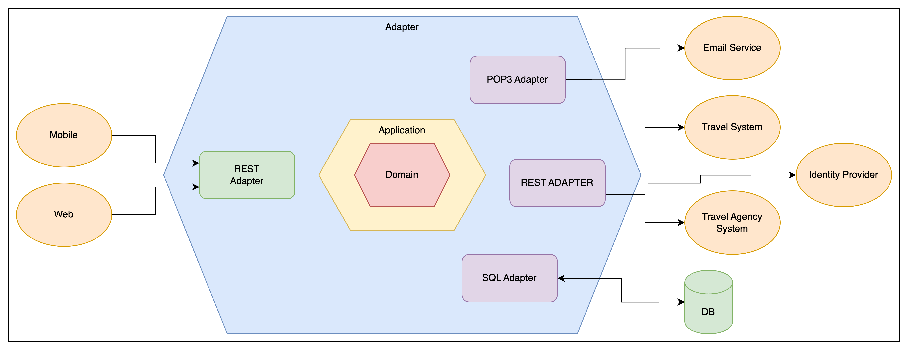

# Architecture

Here you find the documentation of the software architecture that we purpose to address Road Warrior requirements.

## [DDD Context Map](./ddd-context-map.md)

The following architecture view is a DDD Context Map. It shows how the Road Warrior system is broken up into bounded contexts (BCs) and how they interact with each other.

## [Context Diagram](./context-diagram.md)

A context diagram is a high-level overview of a system and its interactions with external entities. It is a graphical representation that shows the system as a single process and the data that flows into and out of it. Context diagrams are used to communicate the scope and purpose of a system to stakeholders and to identify the major components of the system.

This document presents a context diagram for the The Road Warrior system. The system is a a system that manage user travel reservations and group it by trip. The diagram shows the system as a single process and the data that flows into and out of it. The external entities that interact with the system are also shown.

# [Container Diagram](./container-diagram.md)

A system container diagram is a diagram that shows the high-level architecture of a system using components. Components are logical units that perform a specific function in the system. Container diagrams are used to communicate the architecture of a system to stakeholders and to help architects and developers plan and implement the system.

This document presents a system container diagram for the Road Warrior system. The system is a a system that manage user travel reservations and group it by trip. The diagram shows the high-level architecture of the system and how it is decomposed into components.

# [Hexagonal](./hexagonal.md)

This document presents a hexagonal architecture diagram for the Road Warrior system. The system is a a system that manage user travel reservations and group it by trip. The diagram shows the high-level architecture of the system and how it is connected to external system.

# Microservices View

The main part of the software architecture is the set of six architecture views seen below.

[User Microservice](./user-microservice.md)

[Mail Adapter Microservice](./mail-adapter-microservice.md)

[Reservation Microservice EDA](./reservation-microservice-eda.md)

[Travel Agency Adapter Microservice](./travel-agency-adapter-microservice.md)

[Analytic Microservice](./analytic-microservice.md)

[Reporting Microservice](./reporting-microservice.md)

