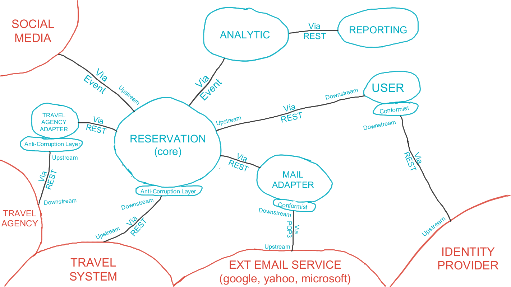

# Architecture

Here you find the documentation of the software architecture that we purpose to address Road Warrior requirements.

## [DDD Context Map](./ddd-context-map.md)

The following architecture view is a DDD Context Map. It shows how the Road Warrior system is broken up into bounded contexts (BCs) and how they interact with each other.

## [Context Diagram](./context-diagram.md)

A context diagram is a high-level overview of a system and its interactions with external entities. It is a graphical representation that shows the system as a single process and the data that flows into and out of it. Context diagrams are used to communicate the scope and purpose of a system to stakeholders and to identify the major components of the system.

This document presents a context diagram for the The Road Warrior system. The system is a a system that manage user travel reservations and group it by trip. The diagram shows the system as a single process and the data that flows into and out of it. The external entities that interact with the system are also shown.

# [Container Diagram](./container-diagram.md)

A system container diagram is a diagram that shows the high-level architecture of a system using components. Components are logical units that perform a specific function in the system. Container diagrams are used to communicate the architecture of a system to stakeholders and to help architects and developers plan and implement the system.

This document presents a system container diagram for the Road Warrior system. The system is a a system that manage user travel reservations and group it by trip. The diagram shows the high-level architecture of the system and how it is decomposed into components.

# Deployment Diagram

This document presents a system deployment diagram for the Road Warrior system. The system is a system that help user to manage travel reservations and group it by trip. The diagram shows the hardware and software components of the system and how they are interconnected.

## Microservices View

The main part of the software architecture is the set of four architecture views seen below.

### User Service

The scope is the operations that the user can perform related to creating and managing an account and user profile, which includes signing in using user ID and password or different credentials (Google, Facebook, etc.).

### Mail Adapter Service

The scope for polling email looking for travel-related emails, filter and whitelist certain emails, parsing & create reservations data into Road Warrior App.

### Reservation Service

This service covers all functionality / core functions related to view, add, update, delete, and share existing reservation, get updated travel details from the agency’s (delays, cancellations, updates, gate changes, etc.) and provide data for summary reports or data analytical.

### Analytic Service

The scope gathers analytical data from users' trips for various purposes - travel trends, locations, airline and hotel vendor preferences, cancellation and update frequency.

### Reporting Service

This service for provide end-of-year summary reports for users with a wide range of metrics about their travel usage.
