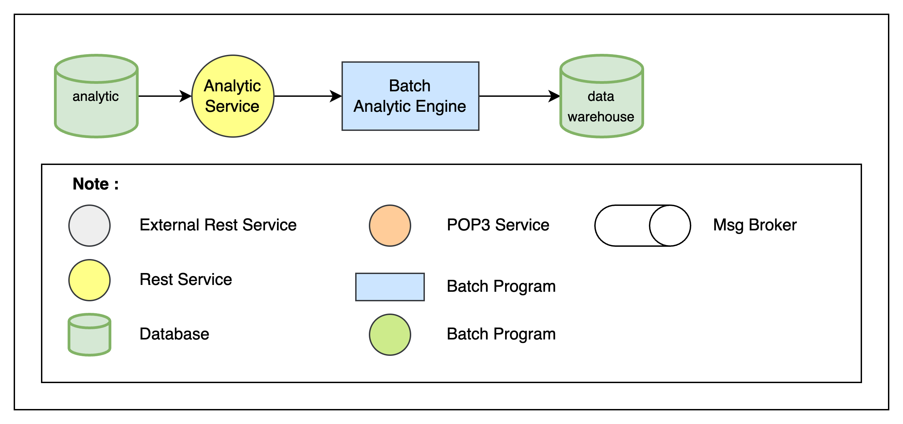

## Analytic Service

The scope gathers analytical data from users' trips for various purposes - travel trends, locations, airline and hotel vendor preferences, cancellation and update frequency.

### Component
#### Analytic Service
- Collect data from user reservation, user activity etc
- Clean, transform, and structure the data to prepare it for analysis.
- Apply statistical, machine learning, or data mining techniques to uncover meaningful insights and patterns within the data.
