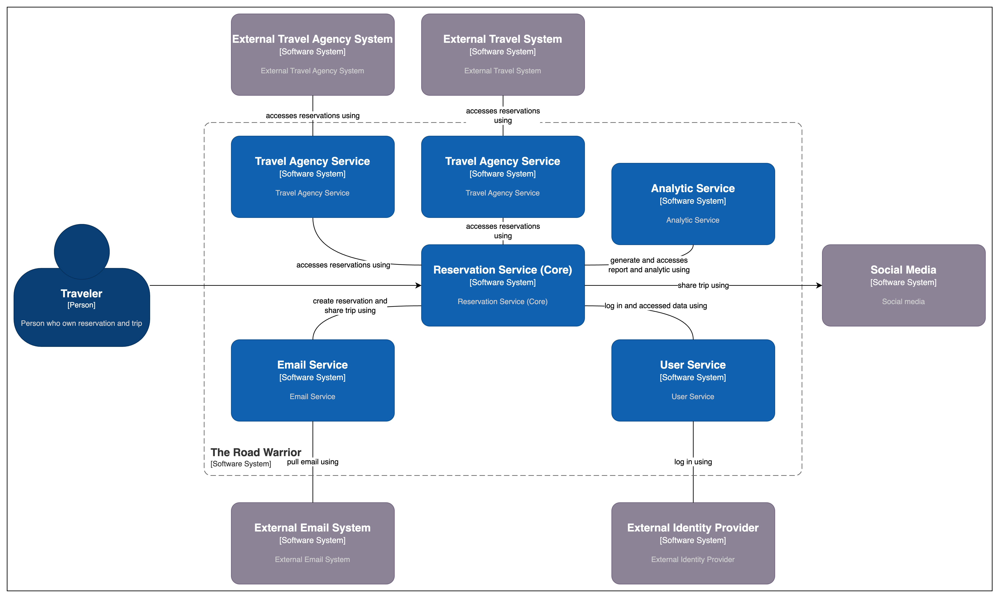

# Container Diagram

A system container diagram is a diagram that shows the high-level architecture of a system using components. Components are logical units that perform a specific function in the system. Container diagrams are used to communicate the architecture of a system to stakeholders and to help architects and developers plan and implement the system.

This document presents a system container diagram for the Road Warrior system. The system is a a system that manage user travel reservations and group it by trip. The diagram shows the high-level architecture of the system and how it is decomposed into components.

