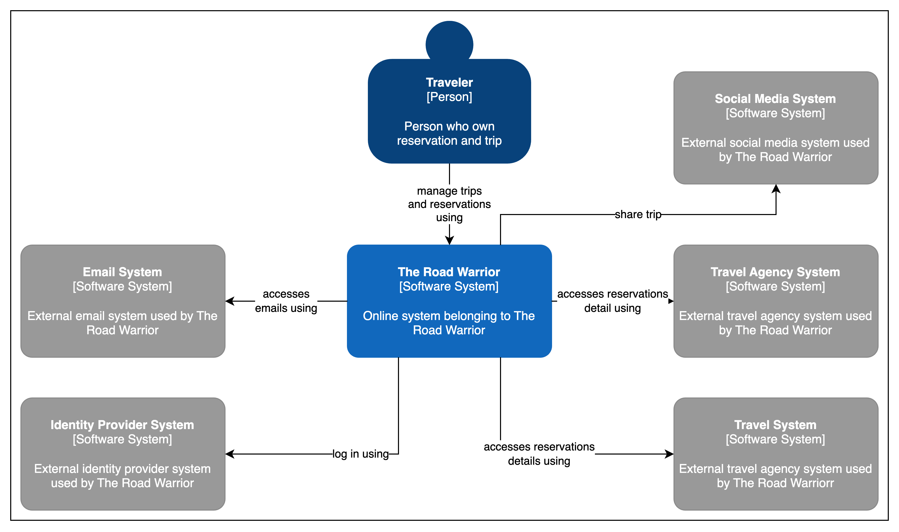

# Context Diagram

A context diagram is a high-level overview of a system and its interactions with external entities. It is a graphical representation that shows the system as a single process and the data that flows into and out of it. Context diagrams are used to communicate the scope and purpose of a system to stakeholders and to identify the major components of the system.

This document presents a context diagram for the The Road Warrior system. The system is a a system that manage user travel reservations and group it by trip. The diagram shows the system as a single process and the data that flows into and out of it. The external entities that interact with the system are also shown.

