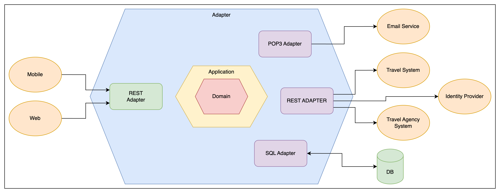

# Hexagonal

Hexagonal architecture, also known as ports and adapters architecture, is a software design pattern that decouples the application's core logic from its outside concerns. This makes the application more flexible, adaptable, and testable.

The core logic of a hexagonal architecture is typically represented by a domain model, which is a set of classes and objects that represent the business entities and rules of the application. The domain model is isolated from the outside world by a layer of ports and adapters.

Ports are abstract interfaces that define the ways in which the core logic can communicate with the outside world. Adapters are concrete implementations of ports that connect the core logic to specific external technologies and frameworks.

For example, an adapter might be responsible for connecting the core logic to a database, a web server, or a messaging system.

The hexagonal architecture has a number of advantages, including:

- Flexibility: The hexagonal architecture allows the application's core logic to be easily adapted to new technologies and requirements. This is because the core logic is isolated from the outside world by the ports and adapters.
- Testability: The hexagonal architecture makes it easier to test the application's core logic. This is because the core logic can be tested in isolation from the outside world.
- Maintainability: The hexagonal architecture makes the application easier to maintain. This is because the core logic is isolated from the outside world, which makes it easier to make changes to the core logic without impacting the outside world.

