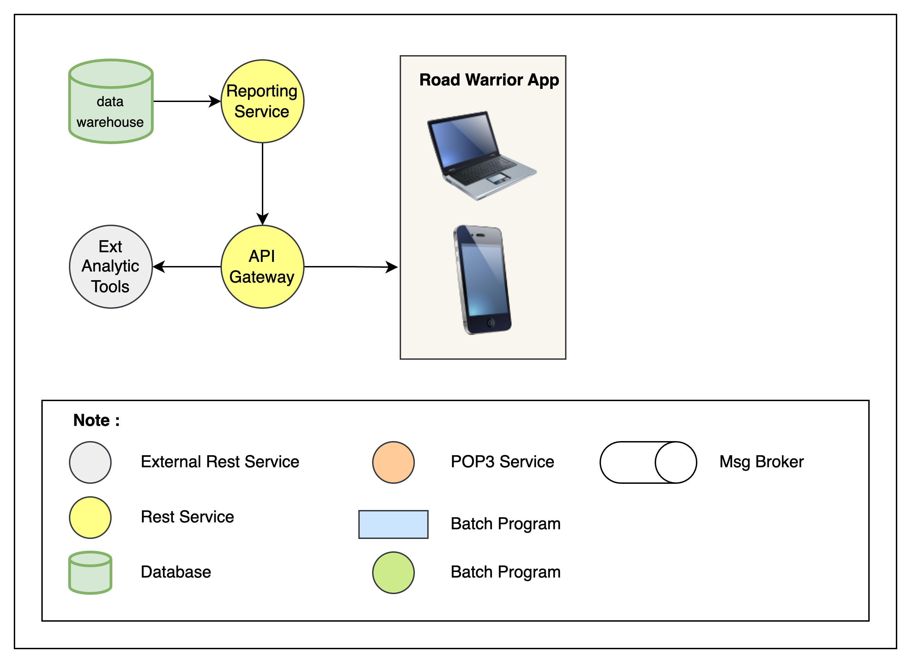

## Reporting Service
This service for provide end-of-year summary reports for users with a wide range of metrics about their travel usage.

### Component
#### Reporting Service
- Present the data analysis results through dashboards, reports, charts, graphs, and other visualizations to make the data more understandable and actionable.
- Provide rest API so it can be used by third parties
