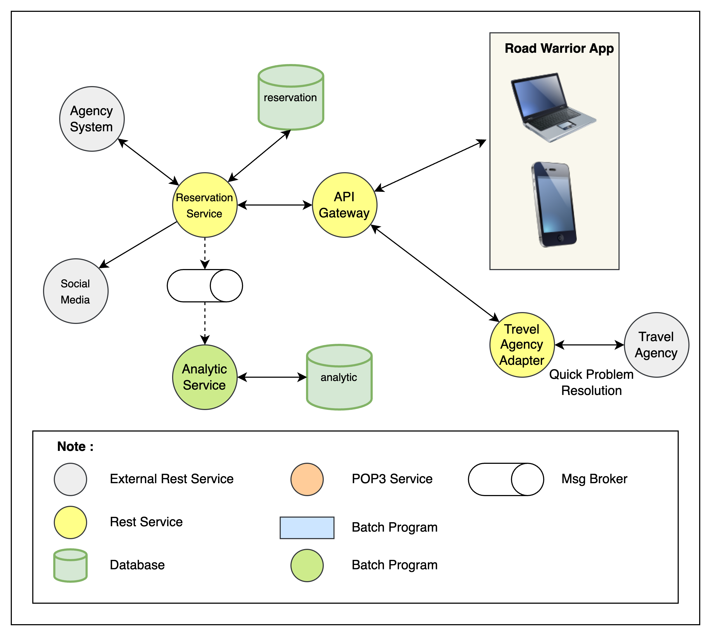

## Reservation Service

This service covers all functionality / core functions related to view, add, update, delete, and share existing reservation, get updated travel details from the agency’s (delays, cancellations, updates, gate changes, etc.) and provide data for summary reports or data analytical.

### Component
#### Reservation Service
- Get reservation details from the Agency System based on reservation data that has been processed from the Mail Adapter Service
- Generate collection of reservation as a Trip
- Share a trip as itinerary to social media
- Reservation data is saved to analytics data asynchronously

#### Travel Agency Adapter
- Integration to Agency System connect with resolution feature if any problem related to reservation
- Integration using rest API
