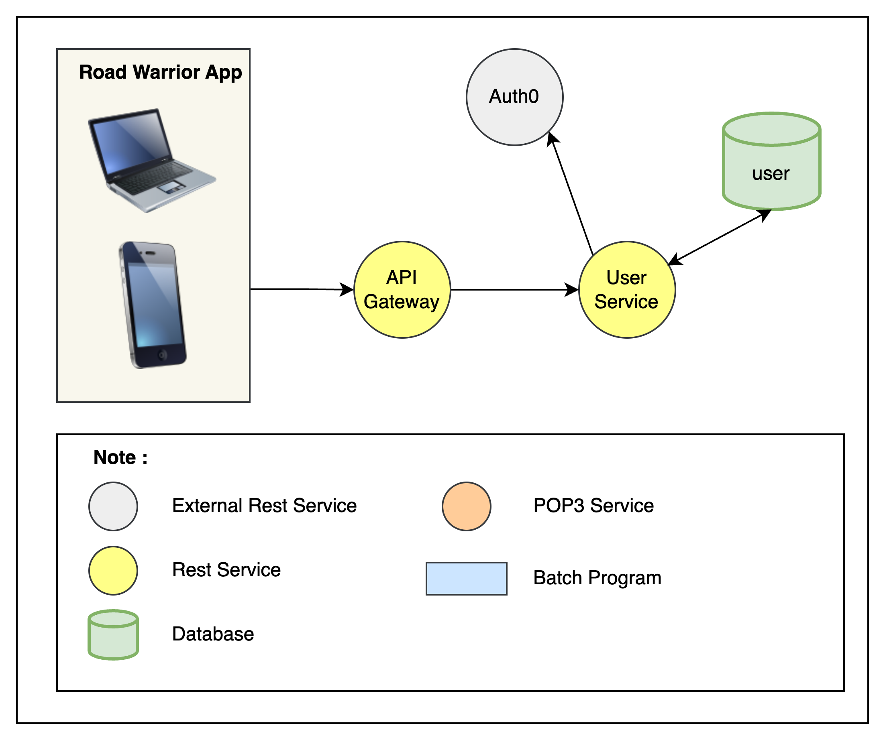

## User Service

The scope is the operations that the user can perform related to creating and managing an account and user profile, which includes signing in using user ID and password or different credentials (Google, Facebook, etc.).

### Element

#### Road Warrior App
Web application created using an SPA framework

#### Api Gateway
Acts as an entry point for multiple APIs (Application Programming Interfaces) or microservices, providing a centralized and unified interface for clients to access various backend services

#### Auth0
External provider for Open ID authentication that allows users to create an account using their Google or Social Media account.
